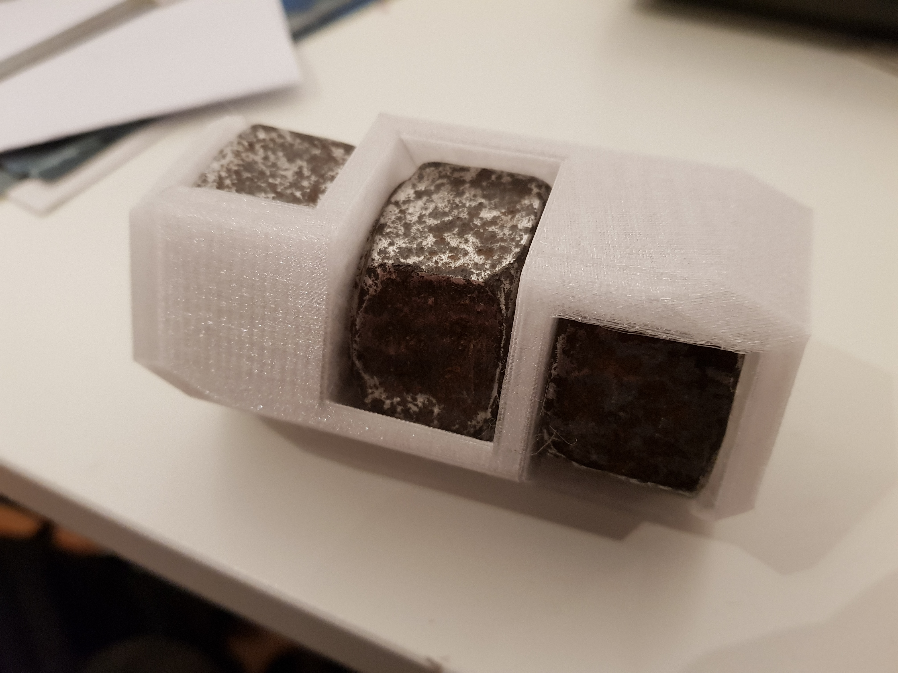

2019-03-22.door-blocker
===

When taking a long walk with some friends in Berlin near some abandoned train tracks we've found three of these big, hevy nuts implicated in holding down train tracks:


I quickly gave in to the impulse to pick these up out of interest for the shape and took them home.
The next days I spent some time removing most of the dirt using metal brushes and my dremel tool.

The result were three nuts where rust is only left in the indentations and the metal is clearly exposed and visible:


Using calipers I took some measurements of the nuts for outer and inner diameters as well as height.
With these I created a model in OpenSCAD that is parametric in these variables:

```openscad
nut_outer_diameter = 44;
nut_inner_diameter = 19;
nut_height = 23;
layer_margin = 5;
layer_count = 3;
```


I printed the model lying on its side so that no support would be required. This would also become the usual resting position as it nicely displays the nuts and is not prone to toppling over.


